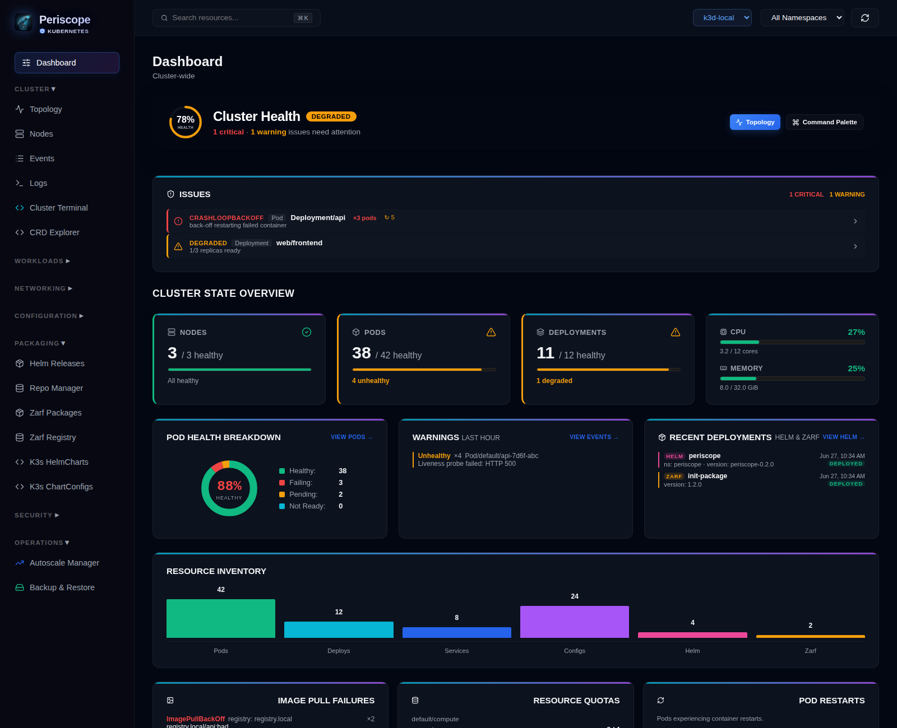
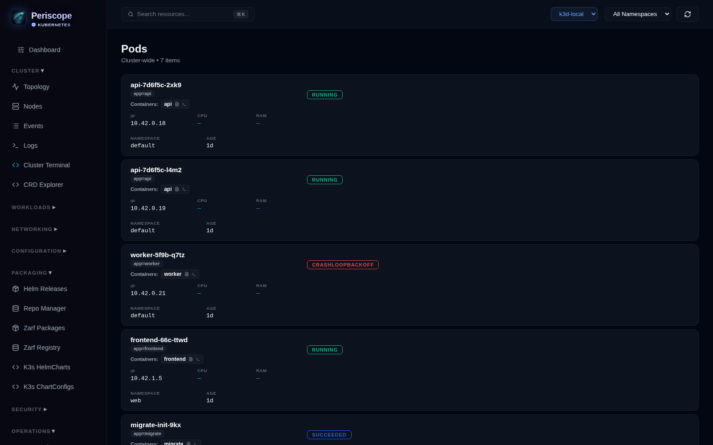
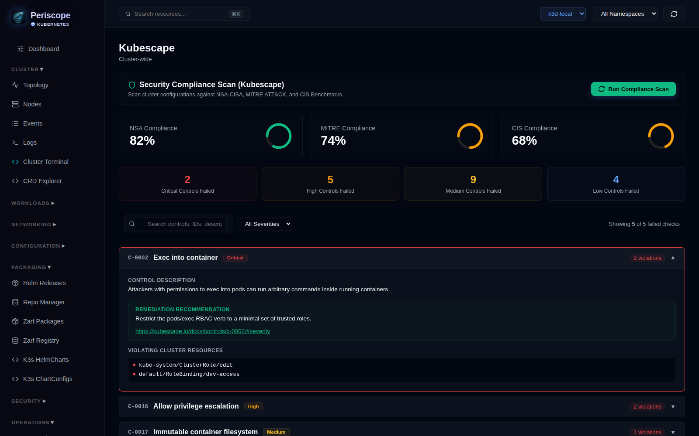
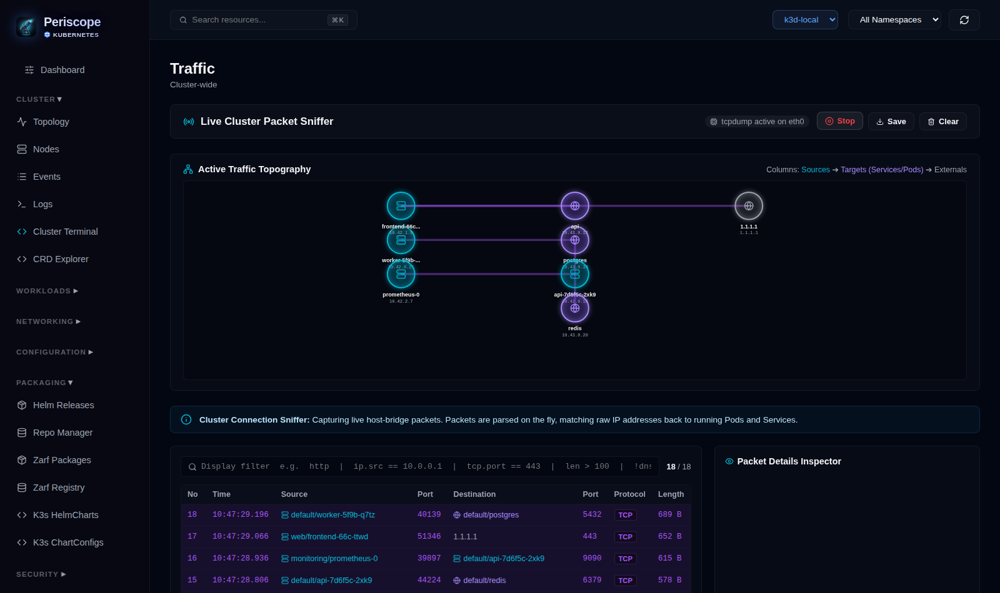
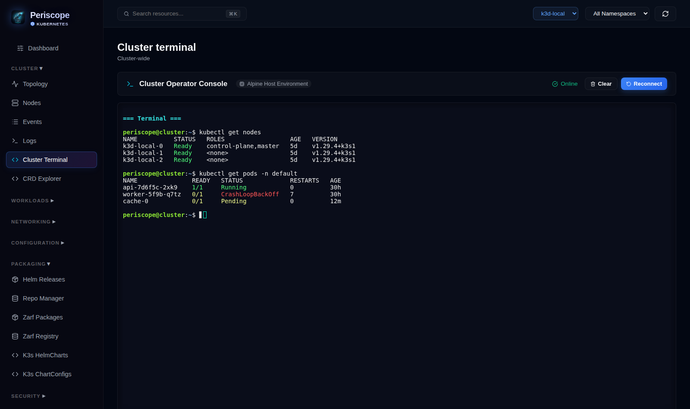
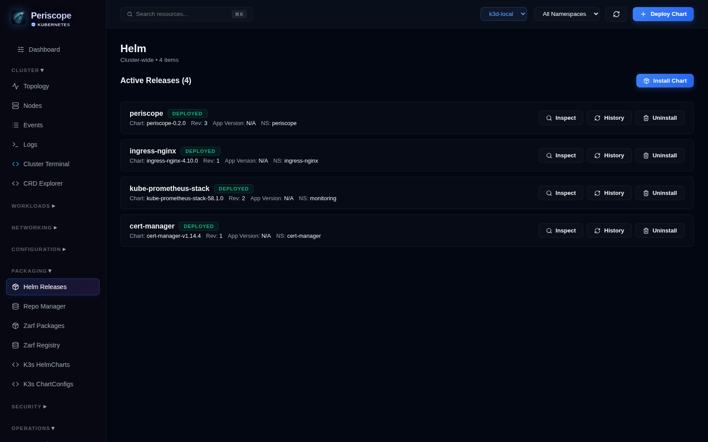
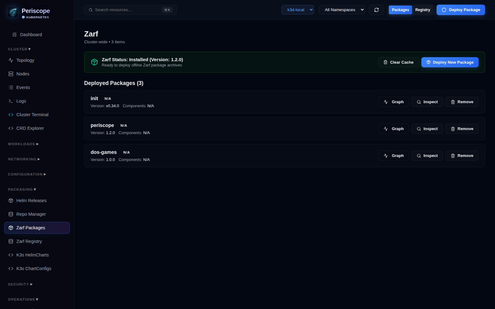

# Periscope

Web-based Kubernetes control plane for visualizing and managing cluster state, security, workloads, Helm releases, and Zarf packages.

[](https://opensource.org/licenses/MIT)


### Dashboard

Cluster-health score with an actionable issues feed



### Resource Management

Resource management, status and metrics.



### Security & Compliance

Kubescape NSA-CISA / MITRE / CIS scoring with per-control remediation, and image vulnerability scanning.



### Traffic Inspector

Live packet capture rendered as a pod-to-pod traffic graph.



### Web Terminal

Browser-based console into the cluster host.



### Helm & Zarf Management

Manage Helm releases and deploy / inspect Zarf packages.




> Screenshots show representative sample data.

---

## Features

- Topology graph — visualizes relationships between nodes, deployments, services, and pods
- Pod terminal and real-time log streaming with regex filtering
- Helm release management with revision history and upgrade support
- Zarf package management and registry browser
- ORAS artifact manager — push, pull, and download OCI registry artifacts directly from the interface
- Image vulnerability scanning via Anchore Grype (SBOM + CVE, air-gap capable)
- Kubernetes security auditing via Kubescape — RBAC, pod hardening, network policy coverage, secrets exposure
- Authentication layer — AES-256-CBC configuration encryption, session management, and forced default password change
- CRD explorer, event alerts, autoscale manager, backup/restore, cluster pruner

---

## Install via Helm

### From OCI registry (recommended)

```bash
helm upgrade --install periscope oci://ghcr.io/jdmldm1/charts/periscope \
  --version 0.3.0 \
  --namespace periscope --create-namespace
```

### From source

```bash
helm upgrade --install periscope ./charts/periscope \
  --namespace periscope --create-namespace
```

### Accessing the UI

The chart defaults to `NodePort` on port `30080`. If your cluster routes that port to your host, open `http://localhost:30080`.

For `ClusterIP` or restricted environments use port-forward:

```bash
kubectl port-forward -n periscope svc/periscope 8080:3001
# then open http://localhost:8080
```

### Authentication Credentials

By default, the authentication layer is enabled. 
- **Default Username:** `admin`
- **Default Password:** `periscope`

When you first log in using the default credentials, you will be prompted to choose a new password. The password configuration is stored symmetrically encrypted (AES-256-CBC) inside `/app/.cache/auth-config.json` on the persistent volume.

### Common values

| Flag | Default | Description |
|---|---|---|
| `service.type` | `NodePort` | `ClusterIP`, `NodePort`, or `LoadBalancer` |
| `service.nodePort` | `30080` | NodePort host port |
| `persistence.enabled` | `true` | PVC for database, credentials, and scan cache |
| `persistence.size` | `5Gi` | PVC size |
| `persistence.storageClass` | `""` | Leave blank to use cluster default |
| `auth.enabled` | `true` | Enable username and password login layer |
| `auth.apiKey` | `""` | Require apiKey header auth (empty = disabled) |
| `ingress.enabled` | `false` | Enable ingress |

Example with ingress and auth:

```bash
helm upgrade --install periscope oci://ghcr.io/jdmldm1/charts/periscope \
  --version 0.3.0 \
  --namespace periscope --create-namespace \
  --set ingress.enabled=true \
  --set ingress.hosts[0].host=periscope.example.com \
  --set ingress.hosts[0].paths[0].path=/ \
  --set ingress.hosts[0].paths[0].pathType=Prefix \
  --set auth.apiKey=your-secret-key
```

### k3d NodePort setup

```bash
k3d cluster create mycluster -p "30080:30080@server:0"

helm upgrade --install periscope oci://ghcr.io/jdmldm1/charts/periscope \
  --version 0.3.0 \
  --namespace periscope --create-namespace \
  --set service.type=NodePort \
  --set service.nodePort=30080
```

---

## Local Development

**Prerequisites:** Node.js v22+, a running Kubernetes cluster, kubeconfig pointed at target cluster.

```bash
# install dependencies
npm install
cd frontend && npm install

# build frontend
npm run build
cd ..

# start server
node server.js
# open http://localhost:3001
```

---

## Install from Zarf

```bash
# Zarf connected package
zarf package deploy oci://ghcr.io/jdmldm1/packages/periscope:1.3.0

# Zarf air-gap package
zarf package deploy oci://ghcr.io/jdmldm1/packages/periscope-airgap:1.3.0
```

---

## License

MIT — see [LICENSE](LICENSE).
